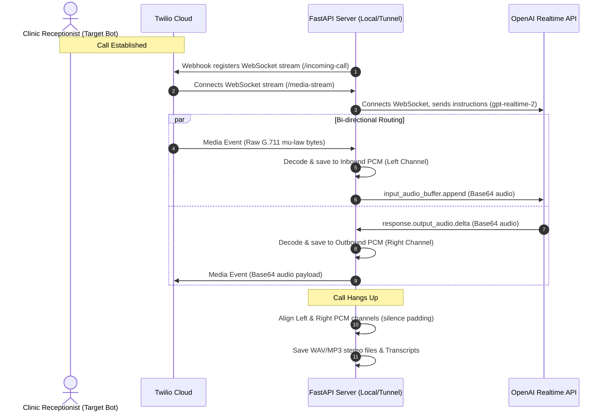

# System Architecture & Design Choices 🏗️

This document describes the architectural flow of the AI Patient Voice Simulator Bot and explains the key technical decisions made during its development.

---

## 🛠️ System Flow Diagram

The diagram below outlines the runtime data flow from the target clinic receptionist, through the Twilio server, to our FastAPI backend, and finally to OpenAI's Realtime API:

---

## 💡 Key Design Choices

### 1. Bi-directional WebSocket Streaming Bridge (`asyncio` Coroutines)
To deliver life-like response times (typically sub-second latency), we bypassed the traditional, high-latency pipeline of full block-based components (Speech-to-Text -> LLM text generation -> Text-to-Speech). Instead, `main.py` uses full-duplex WebSocket connections to bridge Twilio with OpenAI’s Realtime API. 
* **Implementation:** The streaming logic is separated into two concurrent, non-blocking asynchronous tasks (`twilio_to_openai` and `openai_to_twilio`) coordinated by `asyncio.wait()`. This design ensures that audio frames are routed in both directions simultaneously without blocking the event loop.

### 2. Time-Aligned Stereo Recording
To accurately assess conversational quality, interruption behaviors, and speech patterns, we capture the call in true stereo. 
* **Implementation:** Channel 1 (Left) is reserved for the receptionist (inbound audio from Twilio), and Channel 2 (Right) is reserved for the patient bot (outbound audio from OpenAI). We track absolute time relative to the session start. If a channel remains silent while the other is active, we pad that channel with silence (zero samples) to keep the audio streams perfectly aligned. The files are then stitched and encoded to MP3 or OGG using `pydub` and `ffmpeg`.

### 3. Dynamic Patient Scenario Engine
Rather than hardcoding patient personas, we decouple the simulation prompts from the server's streaming logic.
* **Implementation:** All personas are configured as metadata structures in [`scenarios.py`](file:///Users/mohammed/Downloads/ai-patient-bot/scenarios.py). When triggering an outbound call with [`make_call.py`](file:///Users/mohammed/Downloads/ai-patient-bot/make_call.py), the script passes a query parameter `scenario_id` to the Twilio TwiML instruction. The FastAPI WebSocket server parses this ID and configures the OpenAI Realtime session with the target instruction. This enables immediate testing of different personas without server restarts.

### 4. Low-Latency mu-Law to PCM Conversion Table
Twilio transmits audio using the G.711 mu-law codec (8000Hz, mono), whereas audio storage and editing require raw 16-bit linear PCM format.
* **Implementation:** Instead of using heavy audio decoding packages (like `numpy` or `scipy`), we use a precomputed, 256-element G.711 mu-law lookup table in [`utils.py`](file:///Users/mohammed/Downloads/ai-patient-bot/utils.py). This allows us to convert the incoming stream bytes to 16-bit PCM integer arrays in $O(1)$ time, keeping the server's CPU footprint negligible and ensuring maximum speed.
